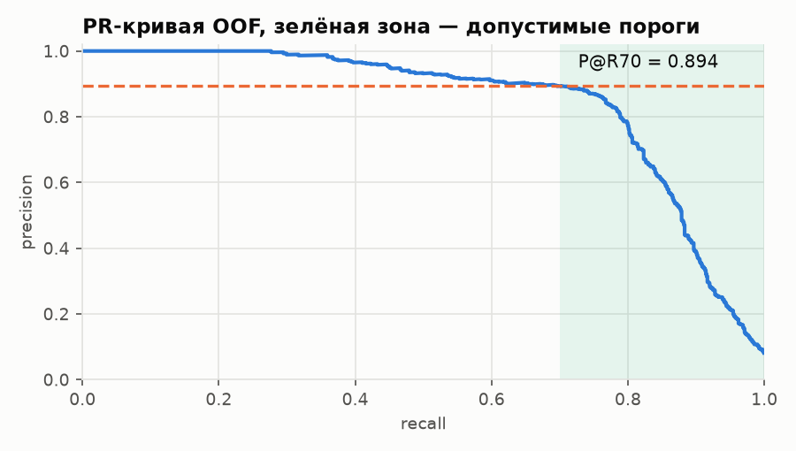

# Детектирование ботов

Каждой куке из `data/test.csv` ставится оценка от 0 до 1 — вероятность принадлежать
трафику сервисов автоматического сбора данных. Метрика — precision при recall ≥ 0.70,
считается кодом из `metric.py`.

## Запуск

```bash
pip install -r requirements.txt          # Python 3.14.7
jupyter nbconvert --execute --inplace solution.ipynb
```

`solution.ipynb` — основной результат: загружает данные, строит признаки, воспроизводит
baseline и финальную модель, пишет `submission.csv`.

То же самое без ноутбука:

```bash
python -m src.submit --name final_pct
```

Первый запуск ноутбука на 12 ядрах — 8 минут 20 секунд, из них сборка 479 признаков
с нуля 27 секунд, остальное кросс-валидация. Повторный запуск короче: матрица признаков
и OOF-массивы кешируются.

## Результат

| | baseline | финальная модель |
|---|---|---|
| признаков | 47 | 479 |
| P@R70 | 0.7621 | **0.8911** |
| ROC-AUC | 0.9289 | 0.9529 |
| PR-AUC | 0.7791 | 0.8404 |
| recall при FPR 1 % | 0.6174 | 0.7486 |

Модель — LightGBM, обученный под 10 сидами с усреднением в ранговом пространстве.



### Как проверялись решения

Целевая метрика шумная: на выборке с 899 позитивами это одна точка PR-кривой, разброс
по дням доходит до 0.15 при стабильном ROC-AUC. Поэтому оптимизация шла по PR-AUC, а
каждое изменение проверялось тремя протоколами сразу:

1. **Случайный K-fold**, 5 фолдов × 5 сидов — основной.
2. **Forward-chaining по дням** — обучение на днях до `k`, проверка на дне `k`. Ловит
   признаки, описывающие популяцию конкретного дня.
3. **`src.strict`** — матрица признаков пересобирается заново только по дням до среза.
   Отличие от второго принципиальное: forward-chaining режет матрицу, построенную один
   раз по всему train, поэтому словари и популяционные статистики в нём посчитаны с
   участием будущих дней.

<details>
<summary>зачем понадобился третий</summary>

Он поймал дефект, который первые два пропустили: признак, дававший +0.110 P@R70 по
случайному CV, давал +0.028 по строгому. Аудитория объявления считалась счётчиком по
фиксированному пулу train, из-за чего обучающая кука сравнивалась со своими
современниками, а тестовая — с куками других недель. Счётчик заменён перцентилем внутри
общего пула. Разбор — в журнале, раздел F38.

</details>

### Журнал

[`JOURNAL.md`](JOURNAL.md) — полный лог: что пробовали, что получилось, что отвергли и
почему.
Отвергнутого там больше, чем принятого: ансамбль трёх семейств, подбор
гиперпараметров, отдельная модель для мобильного трафика, target encoding, веса по
свежести, псевдоразметка — всё измерено на том же протоколе и откачено.

<details>
<summary>Структура</summary>

| путь | назначение |
|---|---|
| `solution.ipynb` | основной прогон с пояснениями |
| `JOURNAL.md` | журнал экспериментов |
| `src/config.py` | пути, сиды, константы |
| `src/data.py` | загрузка, нормализация платформ, фильтр окна наблюдения |
| `src/features.py` | все блоки признаков |
| `src/timeseries.py` | поток событий как точечный процесс |
| `src/pipeline.py` | сборка и кеширование матрицы, запись ответа |
| `src/model.py` | LightGBM / CatBoost / XGBoost за одним интерфейсом |
| `src/validate.py` | метрики, OOF, forward-chaining |
| `src/strict.py` | строгий протокол с пересборкой признаков |
| `src/experiment.py` | запуск одного эксперимента, дописывает `logs/results.jsonl` |
| `src/ablation.py` | leave-one-block-out по 22 семействам признаков |
| `src/ensemble.py` | сравнение семейств моделей и поиск весов |
| `src/diagnose.py` | метрики в разрезе подгрупп |
| `src/tune.py` | подбор гиперпараметров (измерен, отвергнут) |
| `src/encoding.py` | target encoding категориальных ключей (измерен, отвергнут) |
| `src/mobile.py` | специалист по мобильному трафику (измерен, отвергнут) |
| `src/submit.py` | финальное обучение и запись `submission.csv` |
| `tools/make_notebook.py` | генератор `solution.ipynb` |
| `tools/snapshot.py` | архивация кандидатов на отправку |
| `tools/check_submission.py` | проверки формата `submission.csv` |
| `tools/make_figures.py` | картинки для README |

</details>

<details>
<summary>Использованное</summary>

Python 3.14.7, версии библиотек — в `requirements.txt`. Библиотеки: pandas, numpy,
scikit-learn (TF-IDF, TruncatedSVD, StratifiedKFold, isotonic regression), LightGBM,
CatBoost, XGBoost, Optuna, matplotlib.

</details>
